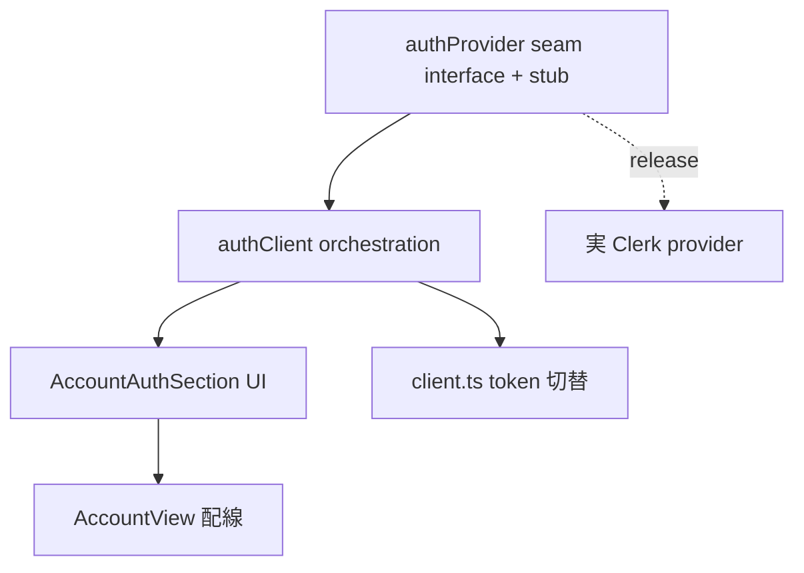

# _shared/auth 変更計画書（連携 / サインアウト UI 動線追加）

> **入力**: `./001_REVISE_SPEC.md`, `../../concept.md` §1.4 / §4.3, Step 2 で読んだ既存実装（account.ts / client.ts / api/auth.ts / main.tsx / AccountView.tsx）
> **最終更新**: 2026-06-21

---

## 1. 既存ファイル変更一覧

| ファイル | 変更内容 | リスク | 関連 SPEC § |
|---|---|---|---|
| `src/lib/api/client.ts` | 連携後の Clerk セッション token 優先付与 + サインアウト時の guest 再 bootstrap ヘルパ追加（`setSessionToken`/`resetToGuest`）。既存 `apiFetch`/`ensureGuestToken`/`clearGuestToken` は不変 | 低（加算）| §7.2 |
| `src/features/account/AccountView.tsx` | 冒頭に AuthSection（状態表示 + 連携/サインアウトボタン）を追加。既存 DSR 削除 UI は不変 | 低 | §7.1 |

## 2. 新規ファイル一覧

| ファイル | 責務 | 依存 | LOC 見積 |
|---|---|---|---|
| `src/lib/auth/authProvider.ts` | Clerk フロント seam の interface + keyless `StubAuthProvider`（isAvailable=false）+ provider 取得（computed specifier で `@clerk/clerk-react` を動的 import、未 install/keyless 時は stub） | client.ts | ~70 |
| `src/lib/auth/authClient.ts` | フロント orchestration: `linkAccount()`（OAuth→JWT→POST link→clear→state）/ `signOut()`（Clerk signOut→clear→re-bootstrap）/ `getAuthState()` | authProvider, client.ts, bootstrap | ~80 |
| `src/features/account/AccountAuthSection.tsx` | 状態表示 + 「Googleで連携」/「サインアウト」ボタン UI（seam unavailable 時は「準備中」無効化）| authClient | ~70 |
| `src/lib/auth/authClient.test.ts` | authClient の unit（mock authProvider + mock fetch）| — | テスト |
| `src/features/account/AccountAuthSection.test.tsx` | UI の状態出し分け + ボタン動作 unit | — | テスト |

## 3. 削除ファイル一覧
なし（純加算）。

## 4. マイグレーション要否
- DB スキーマ変更: ❌
- 既存データ変換: ❌（`linkGuestToAccount` の owner 付替えは実行時・既存実装）
- 設定ファイル変更: ❌（env は既存 `CLERK_PUBLISHABLE_KEY`/`CLERK_SECRET_KEY`、.env.example に既出）
- → **MIGRATION（Phase 5）不要**

## 5. 実装 Phase 分割（/flow:tdd 連携）

### Phase 1 (RED→GREEN→IMPROVE): AuthProvider seam interface + StubAuthProvider
- 対象: `authProvider.ts`（interface + keyless stub: isAvailable=false / signIn/signOut が NotAvailableError）
- ゴール: keyless で seam が安全に「準備中」を返す（build/test 緑、実 SDK 不要）

### Phase 2: authClient orchestration（mock provider 注入でテスト）
- 対象: `authClient.ts`（linkAccount / signOut / getAuthState）
- テスト: mock authProvider（signInWithGoogle→accountToken）+ mock fetch（POST link 204）→ clearGuestToken 呼出 + state=linked / signOut→re-bootstrap + state=guest / API 失敗時 state 維持 + エラー返却
- ゴール: orchestration の全分岐を mock で緑（実 Clerk 不要）

### Phase 3: AccountAuthSection UI + AccountView 配線
- 対象: `AccountAuthSection.tsx` + `AccountView.tsx` への組込
- テスト: seam available→「Googleで連携」表示・押下で linkAccount 呼出 / linked→「サインアウト」表示 / unavailable→「準備中」無効化
- ゴール: 状態出し分け + 両輪ボタンが UI に存在（broad-match マスク解消、O22(B+E) 充足）

### Phase 3.5: 実 Clerk provider 配線（release 時 = キー注入で有効化）
- 対象: `authProvider.ts` の実装版（computed specifier `@clerk/clerk-react` を動的 import、publishable key あり時に有効）
- 注: 実 OAuth round-trip の疎通は release Phase 2（実キー + 実機）で確認。build フェーズは stub/mock で緑。

## 6. 依存関係順序

## 7. ロールアウト計画
| ステップ | 内容 | 期日 | 検証方法 |
|---|---|---|---|
| 1 | UI + orchestration 実装（stub/mock 緑）| 本 revise→tdd | unit green |
| 2 | release で Clerk 実キー FILL → 連携 live 化 | release Phase 1 | 実機で Google 連携→サインアウト→ゲスト の両輪 smoke（aged guest でも踏む）|

## 8. リスク・注意点
- Clerk フロント SDK の具体 API はバージョン差があるため interface を seam で固定し、実装版を release 時に確定（SPEC §9）。
- サインアウト後は新規ゲスト（空進捗）から再開する仕様をユーザーに明示（UI コピーで「連携先のデータは保持されます」）。

## 9. 完了の定義 (DoD)
- [ ] 全 Phase（1-3）完了、Phase 3.5 は release 時
- [ ] unit カバレッジ目標達成（authClient 分岐 + UI 出し分け）
- [ ] E2E: ゲスト→連携→サインアウト→ゲスト の可逆シナリオ（mock provider で local headless、実 OAuth は release smoke）
- [ ] /flow:spec-review 通過
- [ ] audit O22(B+E) が PASS に変わる（連携 + サインアウト動線がコードに存在）

## 10. 更新履歴
| 日付 | 変更概要 | 実行者 |
|---|---|---|
| 2026-06-21 | 初版作成 | /flow:revise |
